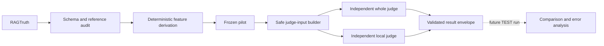

# EvalProbe

EvalProbe asks a narrow evaluation question: **does an LLM judge miss a small unsupported claim inside an otherwise grounded RAG answer?** It is an interview-forward AI evaluation engineering project, not an attempt to build an exhaustive benchmark.

The primary endpoint in the future experiment will be whole-response rejection. Deterministic sentence-level analysis will explain whether a judge can find unsupported content locally even when it approves the answer globally.

## Why RAGTruth

[RAGTruth](https://github.com/ParticleMedia/RAGTruth) provides natural RAG responses with human character-span hallucination annotations. Those spans support both the whole-response reference and a controlled measure of hallucination burden without using an LLM to extract claims. `implicit_true` annotations remain unsupported here: EvalProbe measures grounding against supplied evidence, not truth using outside knowledge.

## Current status

**Phase 0 is complete.** The repository audits RAGTruth, validates annotation offsets,
derives text-free features, and preserves a frozen 60-response QA test pilot.

**Phase 1A implements the judge contract and a six-record TRAIN-only canary.** It uses one
strong judge (`gpt-5.6-sol`, low reasoning) through the OpenAI Responses API. The canary is a
contract diagnostic, not a performance result, and the frozen TEST pilot remains untouched.



## Experimental discipline

- Only `good` QA responses are eligible; `incorrect_refusal` and `truncated` are excluded.
- No annotation means `SUPPORTED`; any annotation means `UNSUPPORTED`.
- Hallucination burden is union span coverage divided by response characters.
- Sentences are fixed rule-based units with exact character offsets, not semantic claims.
- Burden tertiles come only from eligible QA training responses.
- The test pilot targets 30 supported and 30 unsupported responses (10 per burden tertile), with at most one response per `source_id` and seed `20260828`.
- Test data never chooses thresholds. See [judge-input leakage controls](docs/LEAKAGE_CONTROLS.md).
- Whole and local judgments are independent requests with no conversation or reasoning state shared.
- The judge returns only a verdict or unsupported sentence IDs—no rationale or chain-of-thought.
- Paid execution is explicit, resumable, sequential, retry-free, and guarded by a configured cap.

## Reproduce Phase 0

Python 3.12+ and [uv](https://docs.astral.sh/uv/) are required.

```bash
uv sync --all-groups
uv run python scripts/fetch_ragtruth.py
uv run evalprobe phase0 audit
uv run evalprobe phase0 build-pilot
uv run ruff check .
uv run pytest
```

Raw files and the text-bearing manual audit stay local. See [third-party data provenance and handling](THIRD_PARTY_DATA.md) and the [manual-audit instructions](reports/phase0/MANUAL_AUDIT.md).

Generated tracked artifacts contain only IDs, derived numeric metadata, aggregate counts, and a Markdown report. Dataset counts are computed from the files in `data/raw/`; the code does not assert published totals.

## Reproduce the Phase 1A contract check

```bash
uv run evalprobe phase1 canary --dry-run
uv run evalprobe phase1 canary --execute --max-cost-usd 0.50
```

The dry run makes no network calls and persists no request text. Execution requires
`OPENAI_API_KEY` from the environment; it uses no tools, fallback model, or automatic retry.
Exact prompts, schemas, pricing assumptions, and operational behavior are documented in
[Phase 1A](docs/PHASE1A.md).

## Human review console

The local Streamlit console supports reproducible human inspection of the Phase 0 sentence audit
and Phase 1A judge disagreements without contacting a model. It keeps corpus text local while
persisting only safe adjudication metadata. See [Human review console](docs/REVIEW_CONSOLE.md).

## Next gate

The TRAIN canary and the Phase 0 sentence-conversion sample require recorded human review before
the prompt can be frozen and the TEST pilot authorized. Repeated tuning against the six canary
records is intentionally out of scope.
