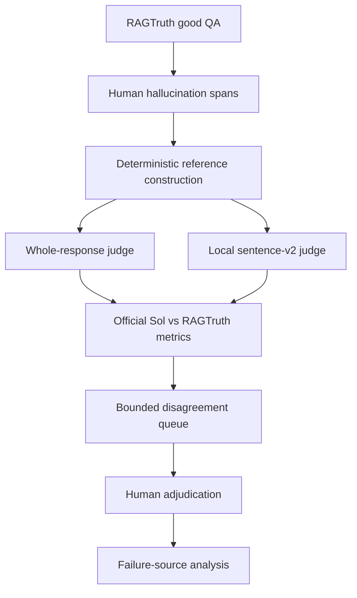
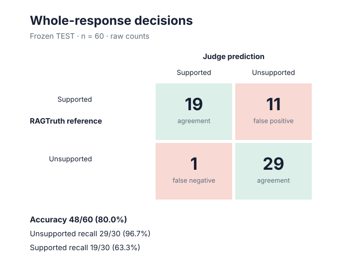
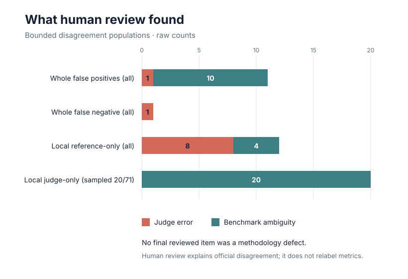

# EvalProbe

A reproducible evaluation framework for testing when an LLM judge can be trusted to assess
grounded RAG answers—and diagnosing whether disagreements come from the judge, benchmark, or
evaluation pipeline.

**Status:** evaluation experiment complete · human error analysis complete · portfolio
consolidation complete

## Why this project exists

LLM-as-judge scores are often treated as truth, but an apparent evaluator error can have several
causes: the judge may be wrong, the benchmark annotation may be incomplete, or preprocessing may
have distorted the unit being evaluated. EvalProbe makes those failure sources observable instead
of assuming either the model or benchmark is infallible.

The project is intentionally narrow and interview-forward: one human-annotated dataset, one frozen
QA pilot, one judge, independent whole/local views, deterministic validation, and a bounded human
adjudication workflow.

## Research question

Does an LLM judge miss a small unsupported claim inside an otherwise grounded RAG answer, and can
local evidence judging recover unsupported content when whole-response judging approves the answer?

The anticipated burden and granularity effects were weak or inconclusive. The strongest result was
instead about evaluation reliability: benchmark disagreement was not equivalent to judge error,
and the first sentence splitter itself manufactured apparent evaluator failures.

## Evaluation pipeline



`deterministic validation ≠ semantic judging ≠ benchmark correctness`

Official metrics always compare frozen `gpt-5.6-sol` predictions with unchanged RAGTruth
references. Human review explains disagreements; it never creates corrected primary metrics.

## Key results

| Frozen TEST result | Finding |
|---|---:|
| Whole-response accuracy | 48/60 = **80.0%** |
| Unsupported recall | 29/30 = **96.7%** |
| Supported recall | 19/30 = **63.3%** |
| Local unsupported recall | 60/72 = **83.3%** |
| Local official precision | 60/131 = **45.8%** |
| Local exact sentence-set agreement | 24/60 = **40.0%** |
| `sentence-v1` audit | **14/20 PASS** |
| `sentence-v2` audit | **20/20 PASS** |

Human review showed why official precision alone was incomplete: all 20 deterministically sampled
local judge-only units were plausible benchmark ambiguities. This describes a 20/71 coverage
sample and is not extrapolated to every judge-only unit.



## Strongest findings

### 1. Evaluator preprocessing can create fake evaluator errors

`sentence-v1` detached standalone list markers from the text they introduced. Span overlap could
then label those markers unsupported, creating inappropriate units and apparent judge misses.
`sentence-v2` removed 10,305 marker-only units while preserving all 2,927 exact span matches; its
fresh human audit passed 20/20.

### 2. Judge/reference disagreement is not automatically judge error

Among 11 official whole false positives, human review classified 10 as plausible benchmark
ambiguity and 1 as judge error. In the sampled local judge-only population, all 20/20 were
benchmark ambiguities. Yet the judge also made genuine mistakes: 8/12 local reference-only misses
and the sole whole false negative were judge errors.

### 3. Strong unsupported recall did not validate the original hypothesis

Unsupported detection was 9/10 low-burden, 10/10 medium, and 10/10 high—weak evidence for a burden
effect. There was only one whole unsupported miss and local judging recovered 0/1, leaving the
planned granularity endpoint underpowered and inconclusive.

## Human error analysis

**Official benchmark:** Sol predictions versus unchanged RAGTruth references.<br>
**Human analysis:** why selected benchmark and judge outputs disagreed.

| Reviewed population | Judge error | Benchmark ambiguity | Methodology defects |
|---|---:|---:|---:|
| Whole false positives (all 11) | 1 | 10 | 0 |
| Whole false negative (all 1) | 1 | 0 | 0 |
| Local reference-only (all 12) | 8 | 4 | 0 |
| Local judge-only (**sampled 20/71**) | 0 | 20 | 0 |



The sampled row is deliberately labelled and kept separate from exhaustively reviewed populations.
See the [frozen TEST findings](docs/findings/test-findings.md) and
[error-analysis record](docs/findings/test-error-analysis.md).

## Engineering and reproducibility

The repository demonstrates frozen manifests, versioned prompts, strict structured outputs, safe
judge-input DTOs, leakage controls, independent requests, a resumable result ledger, provider
failure taxonomy, token/cost accounting, budget guards, deterministic preprocessing, a local human
review console, safe reports, regression tests, and CI checks.

Python 3.12+ and [uv](https://docs.astral.sh/uv/) are required. Raw RAGTruth files remain local.

```bash
uv sync --all-groups
uv run python scripts/fetch_ragtruth.py
uv run evalprobe phase0 audit
uv run evalprobe phase0 build-pilot
uv run evalprobe phase1 canary --dry-run
uv run evalprobe phase1c diagnostics
uv run evalprobe phase2 --dry-run --max-cost-usd 3.00
uv run evalprobe phase3 --prepare
uv run evalprobe review summary
uv run python scripts/build_portfolio_plots.py
uv run ruff check .
uv run pytest
```

The repository contains a paid TEST execution path, but the frozen run is complete and must not be
rerun for reproduction. It requires `OPENAI_API_KEY`, sends corpus-derived inputs to OpenAI, and is
subject to the explicit configured spend cap:

```bash
uv run evalprobe phase2 --execute --max-cost-usd 3.00  # paid; do not rerun frozen TEST
```

## Human Review Console

The Streamlit console supports local inspection of benchmark/judge disagreements while persisting
only safe IDs, classifications, concise notes, and timestamps. Third-party questions, passages,
answers, and annotations remain untracked.

```bash
uv run streamlit run src/evalprobe/review/app.py
```

See [console operations](docs/REVIEW_CONSOLE.md).

## Project structure

```text
configs/                 frozen experiment configuration
src/evalprobe/           audit, judge, persistence, analysis, and review code
reports/                 safe manifests, metrics, plots, and adjudication metadata
docs/methodology/        stable definitions and reference hierarchy
docs/decisions/          frozen methodological decisions
docs/experiments/        execution history
docs/findings/           durable findings and limitations
story.md                 chronological reasoning
docs/interview-guide.md  concise speaking material
```

## Limitations

- Only RAGTruth `good` QA responses were evaluated.
- The frozen TEST pilot contains 60 responses and only 30 unsupported examples.
- One judge model was used; no second provider or judge ensemble was tested.
- Exposure to RAGTruth during model training cannot be ruled out.
- Exact RAGTruth spans are benchmark references, not unquestioned truth.
- Only 20/71 local judge-only units received qualitative review, using a purposive coverage sample.
- The burden effect was weak/null and the granularity endpoint was underpowered at 0/1.
- Local sentence units are deterministic analysis units, not atomic semantic claims.
- Human adjudication is explanatory and does not establish publication-grade corrected labels.

## Learn more

- [Chronological project story](story.md)
- [Knowledge index](docs/INDEX.md)
- [Evaluation design](docs/methodology/evaluation-design.md)
- [Methodology freeze](docs/decisions/methodology-freeze.md)
- [Frozen TEST experiment](docs/experiments/frozen-test.md)
- [Interview guide](docs/interview-guide.md)
- [Third-party data and licensing](THIRD_PARTY_DATA.md)
