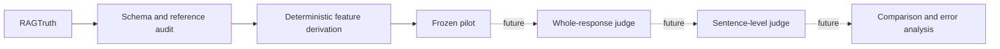

# EvalProbe

EvalProbe asks a narrow evaluation question: **does an LLM judge miss a small unsupported claim inside an otherwise grounded RAG answer?** It is an interview-forward AI evaluation engineering project, not an attempt to build an exhaustive benchmark.

The primary endpoint in the future experiment will be whole-response rejection. Deterministic sentence-level analysis will explain whether a judge can find unsupported content locally even when it approves the answer globally.

## Why RAGTruth

[RAGTruth](https://github.com/ParticleMedia/RAGTruth) provides natural RAG responses with human character-span hallucination annotations. Those spans support both the whole-response reference and a controlled measure of hallucination burden without using an LLM to extract claims. `implicit_true` annotations remain unsupported here: EvalProbe measures grounding against supplied evidence, not truth using outside knowledge.

## Current status: Phase 0

This repository audits the real RAGTruth schema, filters non-quality QA responses, validates every QA annotation offset, derives text-free numeric features, converts spans to deterministic sentence labels, and freezes a 60-response QA test pilot. It contains no judge harness, provider adapter, paid API call, or Phase 1 result.



## Experimental discipline

- Only `good` QA responses are eligible; `incorrect_refusal` and `truncated` are excluded.
- No annotation means `SUPPORTED`; any annotation means `UNSUPPORTED`.
- Hallucination burden is union span coverage divided by response characters.
- Sentences are fixed rule-based units with exact character offsets, not semantic claims.
- Burden tertiles come only from eligible QA training responses.
- The test pilot targets 30 supported and 30 unsupported responses (10 per burden tertile), with at most one response per `source_id` and seed `20260828`.
- Test data never chooses thresholds. See [judge-input leakage controls](docs/LEAKAGE_CONTROLS.md).

## Reproduce Phase 0

Python 3.12+ and [uv](https://docs.astral.sh/uv/) are required.

```bash
uv sync --all-groups
uv run python scripts/fetch_ragtruth.py
uv run evalprobe phase0 audit
uv run evalprobe phase0 build-pilot
uv run ruff check .
uv run pytest
```

Raw files and the text-bearing manual audit stay local. See [third-party data provenance and handling](THIRD_PARTY_DATA.md) and the [manual-audit instructions](reports/phase0/MANUAL_AUDIT.md).

Generated tracked artifacts contain only IDs, derived numeric metadata, aggregate counts, and a Markdown report. Dataset counts are computed from the files in `data/raw/`; the code does not assert published totals.

## Next phase

After a human reviews the conversion sample and the frozen pilot passes all integrity checks, Phase 1 can implement a leakage-controlled whole-response judge and a sentence-level explanatory endpoint. That work is intentionally out of scope here.
